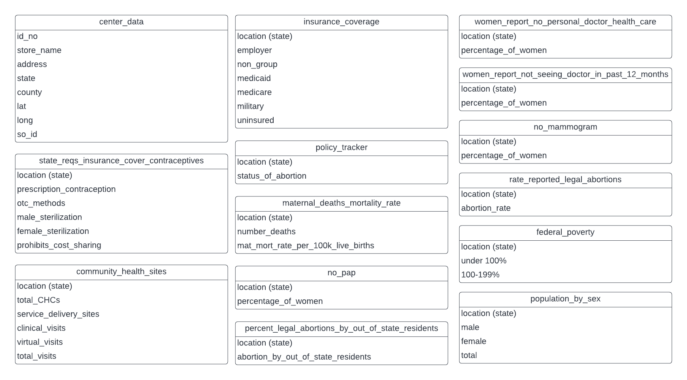

# Table of Contents 

<!-- vscode-markdown-toc -->
* [Overview](#Overview)
* [Data](#Data)
* [Machine Learning](#Machine_Learning)
* [Storyboard](#Storyboard)
* [Roadmap](#Roadmap)

<!-- vscode-markdown-toc-config
	numbering=true
	autoSave=true
	/vscode-markdown-toc-config -->
<!-- /vscode-markdown-toc -->

# Overview

The purpose of this project is to identify the current state of access to reproductive health available in the United States. 

## Key Questions
* Which states have adequate access to reproductive health?
* Which states lack access to reproductive health?
* What are current locations that would benifit from reproductive health centers to address the lack of access to care?

# Data
## Sources

* https://crisispregnancycentermap.com/

    Data will be scraped to identify centers that do not actually provide any reproductive health services. 

* https://www.kff.org/state-category/womens-health/

    Data pertaining to indicators of health access to care, including insurance status, preventitive care, abortion access, teen pregnancy, maternal mortality.

* https://www.plannedparenthood.org/
    
    Data pertaining to current planned parenthood clinics.

The data is organized into databases as followed: 

*Reproductive Health ERD*

## Analysis
✓ Description of the data exploration phase of the project 
✓ Description of the analysis phase of the project

## Machine Learning
We will begin our machine learning using the unsupervised learning method of clustering using K-means. This will help us determine the states that are adaquate and not adaquate.  Than we will use a logistic regression to determine if a county needs additional health clinics or if it has adequate access. 

✓ Description of preliminary data preprocessing

✓ Description of preliminary feature engineering and preliminary feature selection, including their decision-making process 

✓ Description of how data was split into training and testing sets 

✓ Explanation of model choice, including limitations and benefits

## Storyboard
✓ Description of the tool(s) that will be used to create final dashboard 

✓ Description of interactive element(s) 

## Working Agreements
* We agree to be kind and professional.
* We will meet via zoom 30 minutes before each class.
* We will schedule additional meetings as needed, included but not limited to Sunday work sessions from 2-5 pm. 
* We will communicate urgent issues via text.
* We will communicate non-urgent issues via Slack
* We will save documents to our shared Google drive. 
* We agree to push our work to our branch to allow others to review our work. 
* We will update Jamboard to show the flow of our work.

