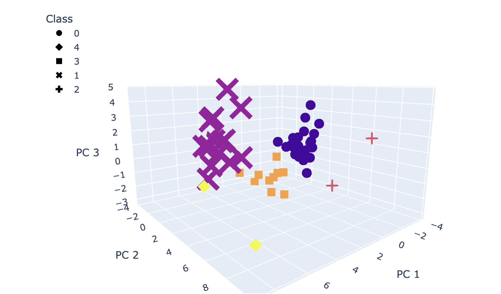
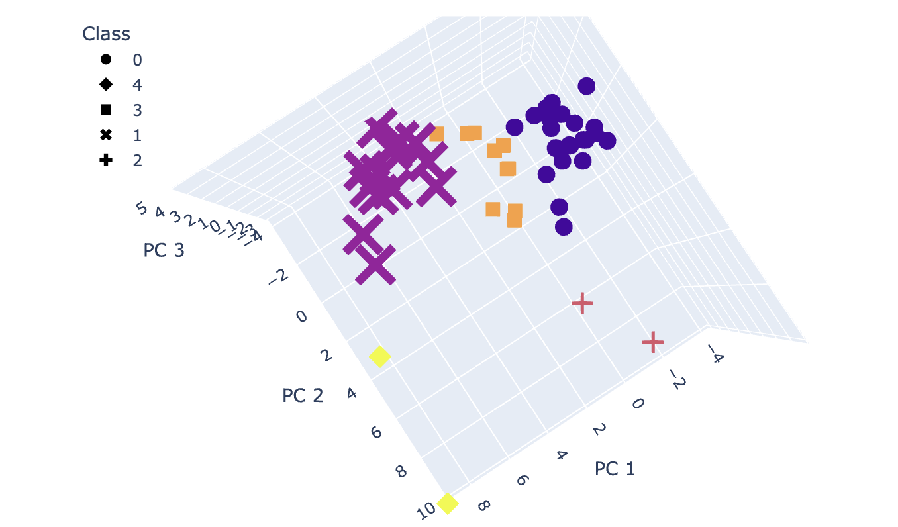

# Table of Contents 

<!-- vscode-markdown-toc -->
* [Overview](#Overview)
* [Data](#Data)
* [Machine Learning](#Machine_Learning)
* [Storyboard](#Storyboard)
* [Working Agreement](#Working)
* [Additional Resources](#AdditionalResources)

<!-- vscode-markdown-toc-config
	numbering=true
	autoSave=true
	/vscode-markdown-toc-config -->
<!-- /vscode-markdown-toc -->

# Overview

The purpose of this project is to identify the current state of access to reproductive health available in the United States. 

## Key Questions
* Which states have adequate access to reproductive health?
* Which states lack access to reproductive health?
* What are current locations that would benifit from reproductive health centers to address the lack of access to care?

# Data
### Preliminary Sources:

* https://crisispregnancycentermap.com/

    Data was scraped to identify centers that do not actually provide any reproductive health services. 

* https://www.kff.org/state-category/womens-health/

    Data pertaining to indicators of health access to care, including insurance status, preventitive care, abortion access, teen pregnancy, maternal mortality.

* https://www.plannedparenthood.org/
    
    Data pertaining to current planned parenthood clinics.
### Cleaned Data
 The data was cleaned, merged and placed in a CSV database called merged.csv

### ERD
The data is organized into databases as followed: 

*Reproductive Health ERD*

### Analysis
* Data Exploration: The preliminary data sources were download individually for each target variable. The data was then cleaned and organized into one single table. The date for crisis centers, community health centers and current reproductive clinics was scrapped from the above websites. The data was than cleaned and unneeded or empty cells were removed. Data between the two tables was standardized for lables and state names. 

* Data Analysis: The prelimary data was analyzed as group. As there are only 51 states it resonable to do the prelimanary work manually. We looked through the rows and columns, checking for any data that did not seem resonable, we discussed any missing data and what the best appoarch for each catagory was. 

# Machine Learning
### Preliminary 
We began our machine learning using the unsupervised learning method of clustering using K-means. This process grouped similar objects together and yield group similar data points together and discover underlying patterns. The model yielded 5 groups of reproductive health care access.  

Preliminary feature engineering and feature selection:

### Data Split, Train and Test
 We than used multiple logistic regression to predict how many more community health clinics an area would need in order to fit with the model that was was trained of the areas that had adequate coverage. 

### Model choice
We choose multiple linear regression. There are multiple independent variables which make this model the most logial to determin the number of clinics that each state needs to add.
 
* Limitations: When using all the independent variables the output for the model prediction is not logical. All of the data process are not on the same normalized scale.
* Benefits: This model allows us to look at multiple data sources 
 
# Storyboard
We will use Plotly, JavaScript and Tablue, to create an interactive data visualization for the web. The completed work will be displayed in a portfolio using Gitpages.

Interactive Features: This interactive web visualization will allow users to select a state and see graphic visualization of the level of access to reproductive healthcare.

[Wire Frame for Storyboard](https://docs.google.com/presentation/d/1fNeITHeLO5w1hP_-IijeZu9O0GGq6SPZkKJ5YKQ_M7E/edit#slide=id.p)

# Working Agreements
* We agree to be kind and professional.
* We will meet via zoom 30 minutes before each class.
* We will schedule additional meetings as needed, included but not limited to Sunday work sessions from 2-5 pm. 
* We will communicate urgent issues via text.
* We will communicate non-urgent issues via Slack
* We will save documents to our shared Google drive. 
* We agree to push our work to our branch to allow others to review our work. 
* We will update Jamboard to show the flow of our work.

# Additional Resources
[Group Google Shared Drive ](https://drive.google.com/drive/u/0/folders/1aURcy_XHSeTBuxBs2TyEmiRUIgIQ5zvV)

[Google Slides Presentation](https://docs.google.com/presentation/d/1kcj6kuOmC0LJDoqfipSAFfxEbHqrjBkker1FSNAJY7w/edit#slide=id.p)

